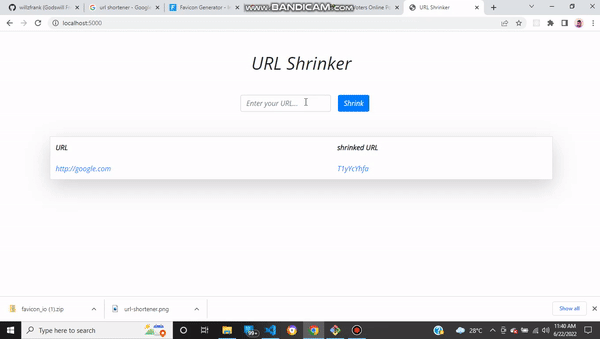

  

<h3 align="center">url-shortener</h3>

---

This is a simple URL Shortener built with nodeJS and uses MongoDB as the database. for the frontend ,bootstrap was used for the styling.
 

## 📝 Table of Contents

- [About](#about)
- [Getting Started](#getting_started)
- [Built Using](#built_using)
- [Authors](#authors)
- [Acknowledgments](#acknowledgement)

## 🧐 About 

This is a simple URL Shortener built with nodeJS and uses MongoDB as the database. for the frontend ,bootstrap was used for the styling.

## 🏁 Getting Started 

if u like this project please leave a star

.

## ⛏️ Built Using 

- [MongoDB](https://www.mongodb.com/) - Database
- [Express](https://expressjs.com/) - Server Framework
- [NodeJs](https://nodejs.org/en/) - Server Environment

## ✍️ Authors 

- [@WillzFrank](https://github.com/willzfrank) - Ground Work

## 🎉 Acknowledgements 

- [@WebDevSimplified](https://github.com/WebDevSimplified) - idea

- References
  [https://github.com/WebDevSimplified/url-shortener]
